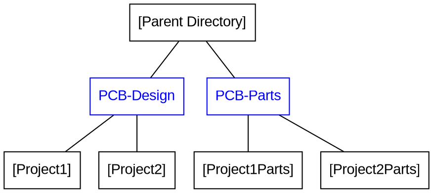

# PCB-Design

## Introduction
The **PCB-Design** and **[PCB-Parts](https://github.com/wmBaja/PCB-Parts)** repositories contain Pack Motorsports Baja's current and previous PCB projects. The two repositories are designed to be used together.

The **PCB-Design** repository should contain folders for each current project. The projects should contain KiCAD project files/folders, but NOT libraries or part files.

The **PCB-Parts** repository should contain any part or library files for the projects in PCB-Design. These part files can include KiCAD symbols or footprints, 3D models, datasheets, 

##Folder Structure
The PCB-Design and PCB-Parts repositories should be organized in a parent folder as follows:

